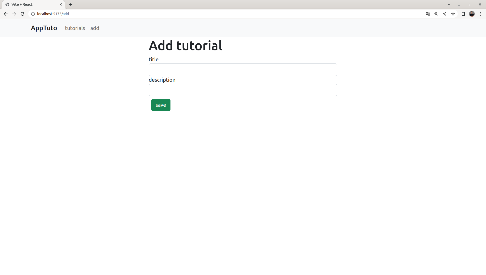
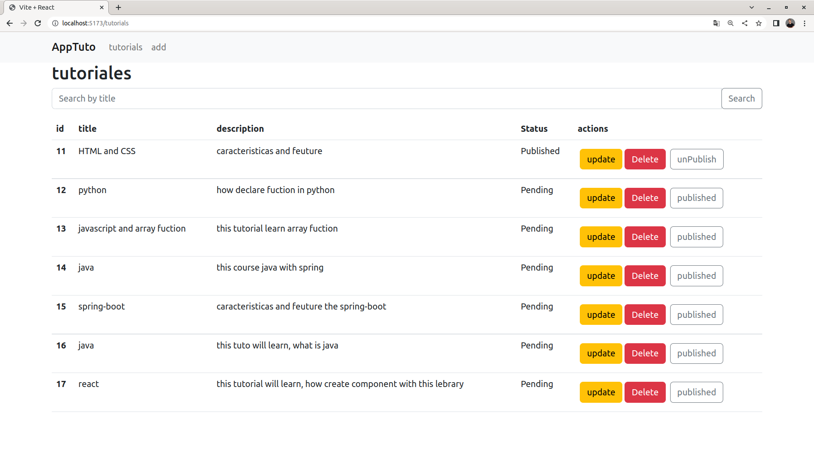

# AppTuto-react
Simple app integraning spring-boot and react, CRUD of tutorial, it name is AppTuto can create list of tutorials, that yuo have pendieng, the list to have title, description and status  

## Repo the project made with spring-boot

you want see project made with spring? [view here](https://github.com/santy-ramirez/tutorials-api) 

## Tecnologias used
- Spring-boot
- react
- bootstrap
- axios
- vite
- mysql

## Screenshop

